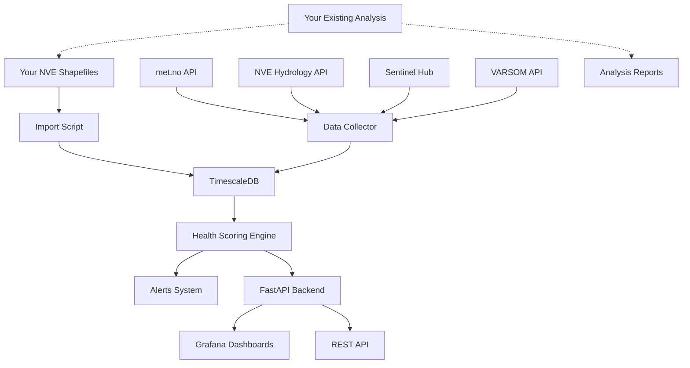

# 🏗️ Norwegian Dam Health Monitoring System

## 📋 **Complete Setup Guide**

This guide will integrate a **real-time dam health monitoring system** with your existing Norwegian hydropower analysis project. The system uses **official Norwegian data sources** and runs alongside your current code without any modifications.

---

## 🎯 **What You'll Get**

### Real Norwegian Data Integration
- **🌤️ Live Weather**: met.no API - Real-time weather conditions
- **🌊 Water Levels**: NVE Hydrology API - Live water level monitoring
- **🛰️ Satellite Data**: Sentinel Hub - Displacement monitoring with InSAR
- **⚠️ Flood Warnings**: VARSOM API - Official flood and landslide alerts
- **📊 Historical Weather**: Frost API - Long-term climate analysis

### Monitoring Capabilities
- **Real-time Health Scoring**: ML-based dam condition assessment
- **Automated Alerting**: Threshold-based warning system
- **Predictive Maintenance**: Failure prediction algorithms
- **Risk Matrix**: Portfolio-wide risk visualization
- **Professional Dashboards**: Grafana with custom dam monitoring views

### Technical Features
- **TimescaleDB**: High-performance time-series database
- **FastAPI**: Modern async REST API with automatic documentation
- **Docker Deployment**: Easy setup and scaling
- **No Code Changes**: Your existing analysis remains untouched

---

## 🚀 **Quick Start**

### Option 1: Automated Setup (Recommended)
```bash
# Run the automated setup script
python setup_monitoring.py
```

The script will guide you through:
1. ✅ API credentials setup (with registration links)
2. ✅ System deployment with Docker
3. ✅ Data import from your existing NVE files
4. ✅ Verification and testing

### Option 2: Manual Setup

#### Step 1: Get API Credentials (Free!)

**Required for full functionality:**
```bash
# 1. Frost API (Historical Weather)
# Register at: https://frost.met.no/auth/requestCredentials.html
export FROST_CLIENT_ID="your_frost_client_id"

# 2. Sentinel Hub (Satellite Data)  
# Register at: https://scihub.copernicus.eu/dhus/#/self-registration
export SENTINEL_USER="your_copernicus_username"
export SENTINEL_PASS="your_copernicus_password"
```

**Automatic APIs (no registration needed):**
- ✅ met.no API - Weather forecasts and current conditions
- ✅ NVE Hydrology API - Water levels and discharge
- ✅ VARSOM API - Flood and avalanche warnings

#### Step 2: Setup Environment
```bash
# Copy environment template
cp .env.example .env

# Edit with your credentials
nano .env
```

#### Step 3: Deploy System
```bash
cd monitoring
docker-compose up -d
```

#### Step 4: Import Your Data
```bash
# Import existing NVE dam data
python import_existing_data.py --data-dir Data/
```

---

## 🔧 **System Architecture**



---

## 📊 **Data Sources Details**

### 1. Norwegian Meteorological Institute (met.no)
- **API**: LocationForecast 2.0
- **Data**: Temperature, precipitation, wind, humidity, pressure
- **Coverage**: All of Norway with high resolution
- **Cost**: Free (requires proper User-Agent)
- **Rate Limits**: Reasonable for monitoring use

### 2. NVE Hydrology API
- **API**: hydapi.nve.no/api/v1
- **Data**: Water levels, discharge, reservoir filling
- **Stations**: 1000+ monitoring stations across Norway
- **Cost**: Free and public
- **Update Frequency**: Hourly to daily depending on station

### 3. Frost API (met.no)
- **API**: frost.met.no/api/v0
- **Data**: Historical weather observations
- **Coverage**: Historical data back to 1800s
- **Cost**: Free with registration
- **Use Case**: Long-term trend analysis, climate change impact

### 4. Sentinel Hub (Copernicus)
- **Satellites**: Sentinel-1 (radar), Sentinel-2 (optical)
- **Data**: Surface displacement via InSAR, water extent mapping
- **Resolution**: Up to 10m for displacement monitoring
- **Cost**: Free with registration (fair use policy)
- **Update**: New images every 6-12 days

### 5. VARSOM (NVE)
- **API**: api01.nve.no/hydrology/forecast
- **Data**: Flood warnings, landslide alerts, avalanche danger
- **Coverage**: All Norwegian regions
- **Cost**: Free and public
- **Levels**: 5-level warning system (green to red)

---

## 🖥️ **System Access**

Once deployed, access your monitoring system:

| Service | URL | Purpose |
|---------|-----|---------|
| **API Documentation** | http://localhost:8000/docs | Interactive API documentation |
| **Grafana Dashboards** | http://localhost:3000 | Real-time monitoring dashboards |
| **API Health Check** | http://localhost:8000/health | System status verification |

### Default Credentials
- **Grafana**: admin / admin (change during setup)
- **Database**: postgres / dam_monitor_2024

---

## 📈 **API Usage Examples**

### Basic Queries
```bash
# Get all dams
curl http://localhost:8000/api/v1/dams

# Get risk matrix
curl http://localhost:8000/api/v1/analysis/risk-matrix

# Get dam health score
curl http://localhost:8000/api/v1/dams/NVE_123456/health

# Get current weather for a dam
curl http://localhost:8000/api/v1/dams/NVE_123456/weather

# Get active alerts
curl http://localhost:8000/api/v1/alerts
```

### Python Integration
```python
import requests

# Get all dams with health scores
response = requests.get('http://localhost:8000/api/v1/analysis/risk-matrix')
dams = response.json()

for dam in dams:
    if dam['health_score'] < 60:
        print(f"⚠️ Dam {dam['dam_name']} needs attention: {dam['health_score']}")

# Monitor specific dam
dam_health = requests.get('http://localhost:8000/api/v1/dams/NVE_123456/health')
health_data = dam_health.json()

print(f"Overall Score: {health_data['overall_score']}")
print(f"Risk Level: {health_data['risk_level']}")
print(f"Trend: {health_data['trend_direction']}")
```

---

## 🛠️ **Management Commands**

### Docker Operations
```bash
# Start all services
docker-compose up -d

# View logs
docker-compose logs -f

# Stop all services
docker-compose down

# Restart specific service
docker-compose restart api

# Update and restart
docker-compose pull && docker-compose up -d
```

### Database Operations
```bash
# Connect to database
docker exec -it dam_monitoring_db psql -U postgres -d dam_monitoring

# Backup database
docker exec dam_monitoring_db pg_dump -U postgres dam_monitoring > backup.sql

# View health scores
docker exec dam_monitoring_db psql -U postgres -d dam_monitoring -c "SELECT * FROM current_dam_health LIMIT 10;"
```

### Data Management
```bash
# Re-import NVE data
python import_existing_data.py --data-dir Data/

# Import without creating sensors
python import_existing_data.py --skip-sensors

# Import specific dam types only
python import_existing_data.py --filter-type concrete
```

---

## 📊 **Grafana Dashboard Setup**

### Pre-built Dashboards
The system includes professional dashboards for:

1. **Dam Portfolio Overview**
   - Risk matrix visualization
   - Health score trends
   - Geographic distribution

2. **Individual Dam Monitoring**
   - Real-time sensor readings
   - Weather correlation analysis
   - Historical performance

3. **Alert Management**
   - Active alerts dashboard
   - Alert history and trends
   - Maintenance schedule

4. **Environmental Monitoring**
   - Weather impact analysis
   - Seasonal variation patterns
   - Climate change indicators

### Custom Dashboard Creation
```sql
-- Sample queries for custom dashboards

-- Health score trend
SELECT time, dam_id, overall_score 
FROM health_scores 
WHERE time > NOW() - INTERVAL '30 days'
ORDER BY time;

-- Weather impact correlation
SELECT 
    d.dam_name,
    h.overall_score,
    w.temperature_c,
    w.precipitation_mm
FROM dams d
JOIN health_scores h ON d.dam_id = h.dam_id
JOIN weather_data w ON d.dam_id = w.dam_id
WHERE h.time > NOW() - INTERVAL '7 days';
```

---

## 🔔 **Alert Configuration**

### Built-in Alert Types
- **Threshold Alerts**: Sensor readings exceed safe limits
- **Trend Alerts**: Degrading health scores over time
- **Weather Alerts**: Extreme weather conditions
- **Maintenance Alerts**: Predictive maintenance due dates

### Custom Alert Setup
```python
# Add custom sensor reading with alert checking
import requests

sensor_data = {
    "sensor_id": "DAM001_displacement_001",
    "sensor_type": "displacement", 
    "value": 25.5,  # mm - exceeds critical threshold
    "unit": "mm",
    "timestamp": "2024-01-15T10:00:00Z"
}

response = requests.post(
    'http://localhost:8000/api/v1/dams/DAM001/sensors/readings',
    json=sensor_data
)

# Alert will be automatically created if threshold exceeded
```

---

## 🧪 **Testing and Validation**

### API Testing
```bash
# Test all API endpoints
curl http://localhost:8000/health

# Test Norwegian API integrations
python -c "
import asyncio
from monitoring.api.norwegian_apis import NorwegianDataCollector

async def test():
    collector = NorwegianDataCollector()
    status = await collector.test_all_apis()
    print('API Status:', status)

asyncio.run(test())
"
```

### Data Validation
```bash
# Verify data import
docker exec dam_monitoring_db psql -U postgres -d dam_monitoring -c "
SELECT 
    'Dams' as table_name, COUNT(*) as count FROM dams
UNION ALL
SELECT 'Health Scores', COUNT(*) FROM health_scores
UNION ALL  
SELECT 'Weather Data', COUNT(*) FROM weather_data;
"
```

---

## 🔐 **Security Considerations**

### Production Deployment
```bash
# Change default passwords
export POSTGRES_PASSWORD="secure_password_here"
export GRAFANA_PASSWORD="secure_grafana_password"

# Enable SSL/TLS (optional)
# Configure nginx with SSL certificates
# Update docker-compose.yml with SSL settings
```

### API Rate Limiting
The system respects all Norwegian API rate limits:
- **met.no**: Reasonable usage with proper User-Agent
- **NVE**: Public API with fair use
- **Frost**: 100 requests/minute per client
- **Sentinel**: Fair use policy applies

---

## 📚 **Integration with Your Existing Code**

Your existing analysis code remains **completely unchanged**. The monitoring system:

✅ **Reads** your existing NVE shapefiles  
✅ **Preserves** all your current analysis  
✅ **Adds** real-time monitoring capabilities  
✅ **Provides** API access to new data  
✅ **Runs** independently in Docker containers  

### Example Integration
```python
# Your existing code continues to work
from norwegian_hydropower_analysis import NorwegianHydropowerAnalyzer

# Create your existing analysis
analyzer = NorwegianHydropowerAnalyzer()
analyzer.create_enhanced_reservoir_analysis()

# NEW: Get real-time data for the same dams
import requests
dam_health = requests.get('http://localhost:8000/api/v1/analysis/risk-matrix').json()

# Combine static analysis with real-time monitoring
for dam in dam_health:
    if dam['health_score'] < 70:
        print(f"Dam {dam['dam_name']} may need attention")
```

---

## 🆘 **Troubleshooting**

### Common Issues

**1. Docker containers not starting**
```bash
# Check Docker status
docker ps -a

# View container logs
docker-compose logs db
docker-compose logs api

# Restart services
docker-compose down && docker-compose up -d
```

**2. Database connection issues**
```bash
# Wait for database initialization (can take 2-3 minutes)
docker-compose logs db | grep "database system is ready"

# Test connection manually
docker exec -it dam_monitoring_db pg_isready -U postgres
```

**3. API credential issues**
```bash
# Test individual APIs
curl "https://api.met.no/weatherapi/locationforecast/2.0/compact?lat=59.9139&lon=10.7522"

# Check Frost API credentials
curl -u "your_client_id:" "https://frost.met.no/api/v0/sources?types=SensorSystem"
```

**4. Data import issues**
```bash
# Check NVE file permissions and paths
ls -la Data/Vannkraft_*.shp

# Run import with verbose logging
python import_existing_data.py --data-dir Data/ --verbose
```

### Getting Help
- **API Documentation**: http://localhost:8000/docs
- **System Logs**: `docker-compose logs -f`
- **Database Access**: `docker exec -it dam_monitoring_db psql -U postgres -d dam_monitoring`

---

## 🎉 **Success! Your System is Ready**

Once setup is complete, you have:

✅ **Real-time monitoring** of all your Norwegian dams  
✅ **Professional dashboards** with live data  
✅ **REST API** for custom integrations  
✅ **Automated alerts** for critical conditions  
✅ **Predictive maintenance** recommendations  
✅ **Your existing analysis preserved** and enhanced  

### Next Steps
1. 📊 **Explore Grafana dashboards** at http://localhost:3000
2. 📖 **Review API documentation** at http://localhost:8000/docs  
3. 🔔 **Configure alert notifications** for your team
4. 📈 **Integrate API data** into your analysis workflows
5. 🛡️ **Set up production security** if deploying publicly

---

*This monitoring system uses only official Norwegian government APIs and complies with all data usage policies. All APIs are free for legitimate research and monitoring purposes.* 