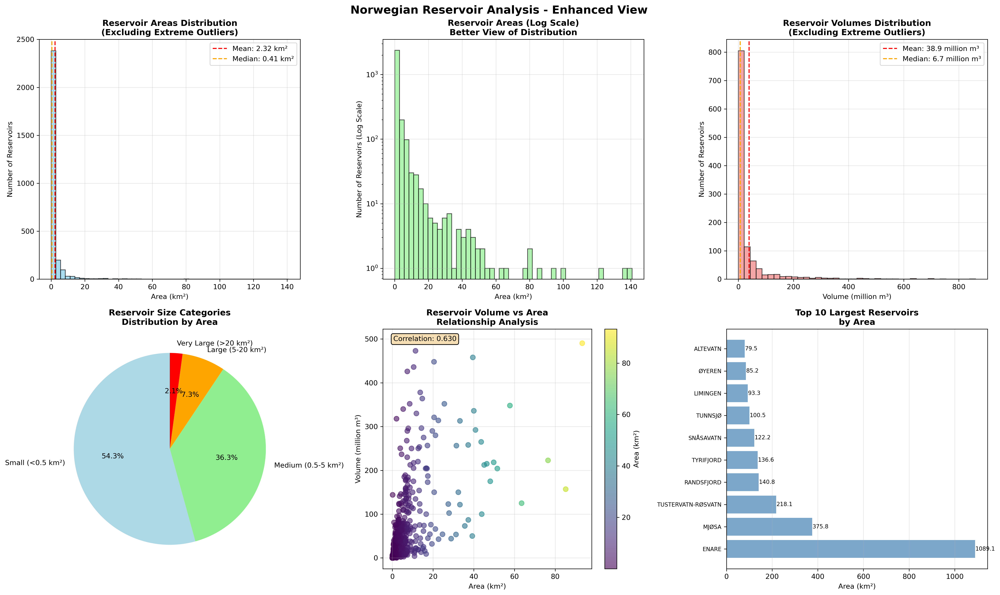
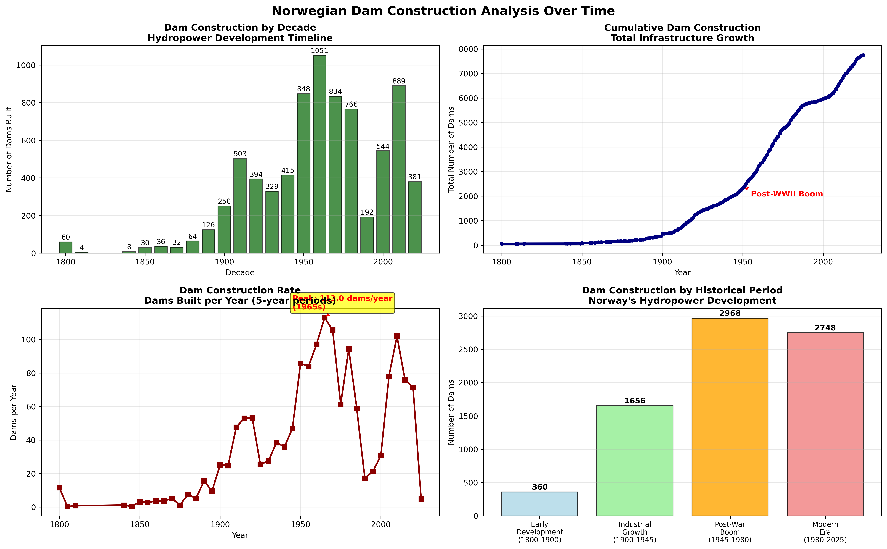
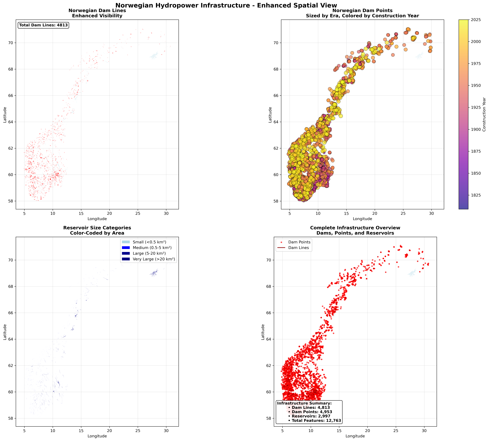

# Norwegian Hydropower Data Analysis

[](https://python.org)
[](LICENSE)
[](https://geopandas.org)

A comprehensive Python toolkit for analyzing Norwegian hydropower infrastructure data from the Norwegian Water Resources and Energy Directorate (NVE). This project provides a complete workflow for loading, processing, analyzing, and visualizing hydropower data including dams, reservoirs, and related infrastructure.

## 🌊 Overview

This toolkit processes Norwegian hydropower data provided in shapefile format and transforms it into various formats suitable for analysis, visualization, and integration with other systems. The project handles three main data types:

- **Dam Lines**: Linear representations of dam structures
- **Dam Points**: Point locations of dam infrastructure  
- **Reservoirs**: Polygon representations of water reservoirs and regulated lakes

## 📊 Sample Results

### Enhanced Reservoir Analysis


*Six-panel analysis showing reservoir area distribution, volume analysis, size categories, and correlation patterns.*

### Dam Construction Timeline


*Historical development of Norwegian hydropower infrastructure from 1660 to 2025, showing the post-WWII construction boom.*

### Enhanced Spatial Visualization


*Geographic distribution of 12,763 infrastructure elements across Norway with enhanced visibility and categorization.*

> 📁 **More Charts**: See the full collection of generated visualizations in the [`docs/images/`](docs/images/) directory and detailed explanations in [`ANALYSIS_REPORT.md`](ANALYSIS_REPORT.md).

## Data Files

The analysis uses the following files, typically provided as a set for each spatial layer:

- **Vannkraft_DamLinje.\***: Data for dams represented as lines
- **Vannkraft_DamPunkt.\***: Data for dams represented as points  
- **Vannkraft_Magasin.\***: Data for reservoirs (lakes, regulated water bodies)

(Where \* includes extensions like .shp, .dbf, .shx, .prj, .cpg)

## Prerequisites

To run the code and analysis, you need a Python environment with the following libraries installed:

```bash
pip install -r requirements.txt
```

### Required Libraries:
- **pandas**: For general data manipulation and analysis
- **simpledbf**: For reading .dbf files (attribute tables from shapefiles)
- **geopandas**: For working with geospatial data, including reading .shp files and handling geometries
- **matplotlib** and **seaborn**: For plotting and visualization
- **requests**: For making HTTP requests (for potential external data integration)
- **shapely**: For geometric operations
- **fiona**: For reading/writing spatial data formats
- **pyproj**: For coordinate reference system transformations

## Workflow Steps

### 1. Data Loading and Conversion (.dbf to .csv)
The initial step involves loading the attribute data from the .dbf files and converting them into a more universally accessible CSV format.

**Input Files**: Vannkraft_DamLinje.dbf, Vannkraft_DamPunkt.dbf, Vannkraft_Magasin.dbf  
**Process**: Use libraries to read the .dbf files into pandas DataFrames, then save to CSV  
**Output Files**: Vannkraft_DamLinje.csv, Vannkraft_DamPunkt.csv, Vannkraft_Magasin.csv

### 2. Understanding Data Content
After converting to CSV, inspect the content to understand available attributes.

**Key Columns Analyzed**:
- damNavn/magNavn: Dam/reservoir names
- idriftAar: Construction year
- formal_L: Primary purpose
- areal_km2: Reservoir area
- volOppdemt: Capacity

### 3. Spatial Data Exploration (.shp Loading)
Load the geographic location and shape data from shapefiles.

**Input Files**: Vannkraft_DamLinje.shp, Vannkraft_Magasin.shp  
**Process**: Use geopandas to read .shp files into GeoDataFrames  
**Output**: GeoDataFrames with both attributes and geometry

### 4. Combining Attributes and Geometry (Export to CSV with WKT)
Convert spatial objects to Well-Known Text (WKT) format and save with attributes.

**Process**: Convert geometry column to WKT, drop original geometry, save to CSV  
**Output Files**: Vannkraft_DamLinje_with_geometry.csv, Vannkraft_Magasin_with_geometry.csv

### 5. Export for Visualization (to KML)
Export GeoDataFrames to KML format for visualization in Google Earth.

**Process**: Select relevant columns, simplify complex geometries, export to KML  
**Output Files**: Vannkraft_DamLinje_subset.kml, Vannkraft_Magasin_simplified_50m.kml

## Usage

### Quick Start

1. **Install dependencies**:
   ```bash
   pip install -r requirements.txt
   ```

2. **Run the analysis**:
   ```bash
   python norwegian_hydropower_analysis.py
   ```

3. **Check outputs**:
   All generated files will be saved in the `output/` directory.

4. **View analysis report**:
   See `ANALYSIS_REPORT.md` for detailed explanations of all charts and insights.

### Programmatic Usage

```python
from norwegian_hydropower_analysis import NorwegianHydropowerAnalyzer

# Create analyzer instance
analyzer = NorwegianHydropowerAnalyzer()

# Run complete workflow
analyzer.run_complete_workflow()

# Or run individual steps
analyzer.load_dbf_files()
analyzer.explore_data_content()
analyzer.load_spatial_data()
analyzer.combine_attributes_geometry()
analyzer.export_for_visualization()
analyzer.create_visualizations()
analyzer.generate_summary_report()
```

## Output Files

The analysis generates the following output files in the `output/` directory:

### CSV Files
- `Vannkraft_DamLinje.csv` - Dam line attributes
- `Vannkraft_DamPunkt.csv` - Dam point attributes  
- `Vannkraft_Magasin.csv` - Reservoir attributes
- `Vannkraft_DamLinje_with_geometry.csv` - Dam lines with WKT geometry
- `Vannkraft_DamPunkt_with_geometry.csv` - Dam points with WKT geometry
- `Vannkraft_Magasin_with_geometry.csv` - Reservoirs with WKT geometry

### KML Files (for Google Earth)
- `Vannkraft_DamLinje_subset.kml` - Dam lines for visualization
- `Vannkraft_Magasin_simplified_50m.kml` - Simplified reservoirs for visualization

### Visualization Files
- `norwegian_hydropower_overview.png` - Overview maps
- `norwegian_hydropower_analysis.png` - Analysis plots and histograms

### Report
- `analysis_report.txt` - Summary report of the analysis

## Data Source

The data is provided by the Norwegian Water Resources and Energy Directorate (NVE) and contains comprehensive information about Norway's hydropower infrastructure.

## Next Steps

Following these data preparation steps, you can proceed with:

1. **Further Analysis**: Analyze characteristics of dams and reservoirs based on attribute data
2. **Spatial Analysis**: Perform spatial analysis using the geometry data
3. **External Integration**: Integrate external data (weather, population, etc.) based on location
4. **Interactive Visualizations**: Create interactive visualizations and dashboards
5. **Machine Learning**: Apply ML techniques for pattern recognition and prediction

## Troubleshooting

### Common Issues

1. **Missing dependencies**: Install all required packages using `pip install -r requirements.txt`
2. **File encoding issues**: The script handles Latin-1 encoding for Norwegian characters
3. **Large file sizes**: Reservoir shapefiles can be large; the script includes simplification for KML export
4. **CRS issues**: The script automatically handles coordinate reference system transformations

### Error Messages

- **"Data not loaded"**: Run `load_dbf_files()` first
- **"Spatial data not loaded"**: Run `load_spatial_data()` first
- **"simpledbf not available"**: Install with `pip install simpledbf`

## 🤝 Contributing

We welcome contributions! Please feel free to submit a Pull Request. For major changes, please open an issue first to discuss what you would like to change.

### Development Setup

1. Fork the repository
2. Create a feature branch (`git checkout -b feature/AmazingFeature`)
3. Commit your changes (`git commit -m 'Add some AmazingFeature'`)
4. Push to the branch (`git push origin feature/AmazingFeature`)
5. Open a Pull Request

### Ideas for Contributions

- Integration with external APIs (weather, population data)
- Advanced spatial analysis algorithms
- Interactive web visualizations
- Machine learning models for hydropower prediction
- Additional data export formats
- Performance optimizations

## 📊 Data Attribution

This project uses data from the Norwegian Water Resources and Energy Directorate (NVE). Users are responsible for compliance with NVE's data licensing terms.

## 📄 License

This project is licensed under the MIT License - see the [LICENSE](LICENSE) file for details.

## 🙏 Acknowledgments

- Norwegian Water Resources and Energy Directorate (NVE) for providing the data
- GeoPandas and pandas development teams
- Python geospatial community

## 📞 Support

If you encounter any issues or have questions, please [open an issue](../../issues) on GitHub. 

