# Arctic Dam Risk Analysis - Detailed Workflow

```mermaid
flowchart TD
    A["Arctic Dam Risk Analysis<br/>499 Norwegian Dams Above 66.5°N"] --> B["Data Collection Phase"]
    A --> C["Risk Assessment Framework"]
    A --> D["Analysis & Results"]
    A --> E["Reporting & Deliverables"]
    
    %% Data Collection Phase
    B --> B1["Norwegian APIs Integration"]
    B1 --> B1a["Seklima Weather Data<br/>- Real-time Temperature<br/>- Precipitation Data<br/>- Climate Projections<br/>- 9 Arctic Weather Stations"]
    B1 --> B1b["NVE Dam Database<br/>- 486 Validated Dams (97.4%)<br/>- Dam Coordinates<br/>- Construction Years<br/>- Purpose Classification"]
    
    B --> B2["Climate Data Processing"]
    B2 --> B2a["IPCC AR6 Scenarios<br/>- Temperature Projections<br/>- 2050 Climate Models<br/>- Arctic Amplification"]
    B2 --> B2b["Historical Data<br/>- 20-Year Records<br/>- Seasonal Patterns<br/>- Temperature Anomalies"]
    
    %% Risk Assessment Framework
    C --> C1["Risk Components (Weighted)"]
    C1 --> C1a["Permafrost Stability (40%)<br/>- Stefan Equation<br/>- Active Layer Thickness<br/>- Foundation Stability<br/>- Thresholds: Low ≤10, Med 10-20, High >20"]
    C1 --> C1b["Ice Dam Formation (25%)<br/>- Ice Thickness Calculation<br/>- Jam Probability<br/>- Frazil Ice Risk<br/>- Thresholds: Low ≤8, Med 8-15, High >15"]
    C1 --> C1c["Freeze-Thaw Degradation (20%)<br/>- Cycle Counting<br/>- Service Life Reduction<br/>- Material Degradation<br/>- Thresholds: Low ≤10, Med 10-18, High >18"]
    C1 --> C1d["Climate Change Impact (15%)<br/>- Temperature Projections<br/>- Risk Multiplier<br/>- Future Scenarios<br/>- Severe >2.5°C, Significant 2.0-2.5°C"]
    
    C --> C2["Geographic Zones"]
    C2 --> C2a["Arctic Circle Zone<br/>66.5-68°N<br/>152 Dams (30.5%)<br/>Transitional Arctic"]
    C2 --> C2b["Mid Arctic Zone<br/>68-70°N<br/>268 Dams (53.7%)<br/>Established Arctic"]
    C2 --> C2c["High Arctic Zone<br/>70°N+<br/>79 Dams (15.8%)<br/>Extreme Arctic"]
    
    C --> C3["Risk Calculation Methods"]
    C3 --> C3a["Stefan Equation<br/>Permafrost Depth<br/>Thermal Properties<br/>Norwegian Arctic Parameters"]
    C3 --> C3b["Ashton Ice Engineering<br/>Ice Formation Models<br/>Jam Probability<br/>Seasonal Timing"]
    C3 --> C3c["ACI Freeze-Thaw Standards<br/>Zero-Crossing Analysis<br/>Concrete Degradation<br/>Service Life Models"]
    
    %% Analysis & Results
    D --> D1["Risk Categorization"]
    D1 --> D1a["High Risk Dams<br/>Score >50<br/>Immediate Action Required<br/>Enhanced Monitoring"]
    D1 --> D1b["Medium Risk Dams<br/>Score 35-50<br/>Regular Monitoring<br/>Preventive Measures"]
    D1 --> D1c["Low Risk Dams<br/>Score ≤35<br/>Standard Maintenance<br/>Routine Inspection"]
    
    D --> D2["Climate Impact Analysis"]
    D2 --> D2a["Severe Impact<br/>>2.5°C Warming<br/>79 Dams (15.8%)<br/>Critical Adaptation Needed"]
    D2 --> D2b["Significant Impact<br/>2.0-2.5°C Warming<br/>268 Dams (53.7%)<br/>Enhanced Planning"]
    D2 --> D2c["Moderate Impact<br/>≤2.0°C Warming<br/>152 Dams (30.5%)<br/>Standard Resilience"]
    
    D --> D3["High-Risk Dam Identification"]
    D3 --> D3a["Top Priority Dams<br/>- ØSTVATNET (71.10°N)<br/>- ELVEDALSVATN (71.03°N)<br/>- PRESTVATN (70.99°N)<br/>- STORVATN (71.00°N)"]
    D3 --> D3b["Risk Components Analysis<br/>- Primary Risk Factors<br/>- Geographic Clustering<br/>- Coordinate Mapping"]
    
    %% Reporting & Deliverables
    E --> E1["Academic Publications"]
    E1 --> E1a["LaTeX Research Paper<br/>- 35+ Pages<br/>- 25+ References<br/>- Mathematical Models<br/>- Professional Figures"]
    E1 --> E1b["Peer Review Quality<br/>- ICOLD Standards<br/>- Norwegian Guidelines<br/>- International Comparison"]
    
    E --> E2["Visual Analytics"]
    E2 --> E2a["Risk Overview Dashboard<br/>- Distribution Charts<br/>- Component Analysis<br/>- Threshold Visualization"]
    E2 --> E2b["Geographic Risk Maps<br/>- Coordinate Plotting<br/>- Arctic Zone Analysis<br/>- Climate Correlation"]
    E2 --> E2c["Climate Impact Projections<br/>- Temperature Trends<br/>- Vulnerability Categories<br/>- Regional Variation"]
    
    E --> E3["Policy Recommendations"]
    E3 --> E3a["Immediate Actions<br/>- High-Risk Dam Assessment<br/>- Emergency Response Plans<br/>- Enhanced Monitoring"]
    E3 --> E3b["Long-term Strategy<br/>- Climate Adaptation<br/>- Infrastructure Upgrades<br/>- Design Standards Update"]
    
    %% Styling
    classDef dataPhase fill:#e3f2fd,stroke:#1976d2,stroke-width:2px
    classDef riskPhase fill:#f3e5f5,stroke:#7b1fa2,stroke-width:2px
    classDef analysisPhase fill:#e8f5e8,stroke:#388e3c,stroke-width:2px
    classDef reportPhase fill:#fff3e0,stroke:#f57c00,stroke-width:2px
    
    class B,B1,B1a,B1b,B2,B2a,B2b dataPhase
    class C,C1,C1a,C1b,C1c,C1d,C2,C2a,C2b,C2c,C3,C3a,C3b,C3c riskPhase
    class D,D1,D1a,D1b,D1c,D2,D2a,D2b,D2c,D3,D3a,D3b analysisPhase
    class E,E1,E1a,E1b,E2,E2a,E2b,E2c,E3,E3a,E3b reportPhase
```

## Arctic Analysis Workflow Summary

### 📊 **Data Collection Phase** (Blue)
- **Norwegian APIs**: Seklima weather data + NVE dam database
- **Climate Processing**: IPCC AR6 scenarios + historical records
- **Coverage**: 100% real weather data, 97.4% NVE validation

### ⚖️ **Risk Assessment Framework** (Purple)
- **4 Risk Components**: Permafrost (40%), Ice Dam (25%), Freeze-Thaw (20%), Climate (15%)
- **3 Geographic Zones**: Arctic Circle, Mid Arctic, High Arctic
- **Mathematical Models**: Stefan equation, Ashton ice engineering, ACI standards

### 🎯 **Analysis & Results** (Green)
- **Risk Categorization**: High (>50), Medium (35-50), Low (≤35)
- **Climate Impact**: Severe (>2.5°C), Significant (2.0-2.5°C), Moderate (≤2.0°C)
- **High-Risk Identification**: 4 priority dams with coordinates

### 📋 **Reporting & Deliverables** (Orange)
- **Academic Publication**: 35+ page LaTeX paper with peer-review quality
- **Visual Analytics**: 6 professional figures with risk dashboards
- **Policy Recommendations**: Immediate actions + long-term strategy

### 🔢 **Key Parameters & Thresholds:**
- **Permafrost Risk**: Low ≤10, Medium 10-20, High >20
- **Ice Dam Risk**: Low ≤8, Medium 8-15, High >15
- **Freeze-Thaw Risk**: Low ≤10, Medium 10-18, High >18
- **Climate Impact**: Moderate ≤2.0°C, Significant 2.0-2.5°C, Severe >2.5°C
