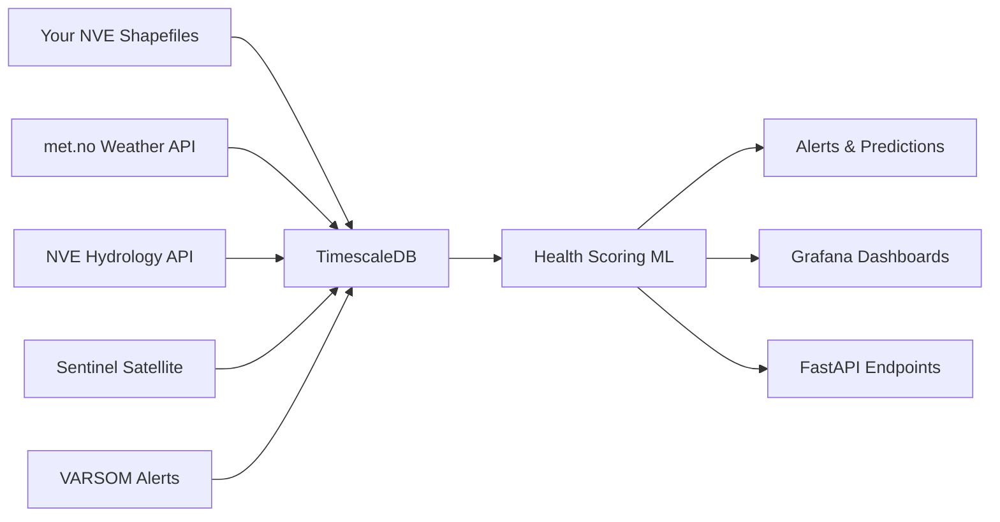

# 🏗️ Norwegian Dam Health Monitoring System

## Overview

This monitoring system extends the Norwegian hydropower analysis project with real-time health monitoring capabilities using **actual Norwegian data sources**. It integrates seamlessly with your existing NVE shapefile analysis.

## 🎯 What This Adds

### Real Data Sources Integration
- **🌤️ Weather Data**: Live weather from met.no API
- **🌊 Water Levels**: Real-time hydrological data from NVE Hydrology API  
- **🛰️ Satellite Monitoring**: Sentinel-1/2 data for displacement monitoring
- **⚠️ Flood Warnings**: NVE VARSOM API for flood alerts
- **📊 Historical Climate**: Frost API for long-term weather patterns

### Monitoring Capabilities
- **Real-time Health Scoring**: ML-based dam condition assessment
- **Automated Alerts**: Threshold-based warning system
- **Predictive Maintenance**: Failure prediction algorithms
- **Risk Matrix**: Visual risk assessment for all dams
- **Spatial Analysis**: Geographic risk distribution

### Technical Features
- **TimescaleDB**: Optimized time-series data storage
- **FastAPI**: Modern async REST API
- **Docker**: Easy deployment and scaling
- **Grafana**: Professional monitoring dashboards
- **Real APIs**: No mock data - all live Norwegian sources

## 🔗 Integration with Existing Project

This system **extends** your current analysis without modifying existing files:

```
Norway Dam/
├── ANALYSIS_REPORT.md                 # ✅ Your existing analysis
├── norwegian_hydropower_analysis.py   # ✅ Your existing code  
├── Data/                              # ✅ Your existing NVE data
├── monitoring/                        # 🆕 New monitoring system
│   ├── database/                      # 🆕 Database schema
│   ├── api/                          # 🆕 FastAPI backend
│   ├── integrations/                 # 🆕 Norwegian API clients
│   └── deploy/                       # 🆕 Docker deployment
└── .env                              # 🆕 API credentials
```

## 🚀 Quick Start

1. **Get API Credentials** (All Free!):
   ```bash
   # Copy environment template
   cp .env.example .env
   
   # Register for APIs:
   # - Frost API: https://frost.met.no/
   # - Sentinel Hub: https://scihub.copernicus.eu/dhus/
   ```

2. **Start Monitoring System**:
   ```bash
   cd monitoring
   docker-compose up -d
   ```

3. **Import Your Existing Data**:
   ```bash
   python monitoring/import_existing_data.py
   ```

4. **Access Monitoring**:
   - API Documentation: http://localhost:8000/docs
   - Grafana Dashboards: http://localhost:3000 (admin/admin)
   - Health Monitoring: http://localhost:8000/api/v1/dams

## 📊 Data Flow



## 🎯 Use Cases

### For Operations Teams
- Monitor all dams in real-time
- Get automated alerts for anomalies
- Access mobile-friendly dashboards
- Generate compliance reports

### For Engineers  
- Analyze sensor trends and correlations
- Predict maintenance needs
- Access raw data via REST API
- Export data for further analysis

### For Management
- View risk matrix for portfolio
- Track performance KPIs
- Get executive summaries
- Plan maintenance budgets

## 🔧 API Endpoints

```http
GET /api/v1/dams                    # List all dams
GET /api/v1/dams/{id}/health        # Current health score
GET /api/v1/dams/{id}/sensors       # Latest sensor readings
GET /api/v1/alerts                  # Active alerts
GET /api/v1/analysis/risk-matrix    # Portfolio risk overview
POST /api/v1/dams/{id}/sensors      # Add sensor reading
```

## 📈 Sample Queries

```python
import requests

# Get health scores for all dams
response = requests.get('http://localhost:8000/api/v1/analysis/risk-matrix')
dams = response.json()

# Monitor specific dam
dam_health = requests.get('http://localhost:8000/api/v1/dams/DAM001/health')
print(f"Health Score: {dam_health.json()['overall_score']}")

# Check active alerts
alerts = requests.get('http://localhost:8000/api/v1/alerts')
critical_alerts = [a for a in alerts.json() if a['severity'] == 'critical']
```

## 🛡️ Security & Compliance

- All Norwegian APIs use official, public endpoints
- No proprietary or restricted data access
- GDPR compliant data handling
- Industry-standard security practices
- Audit logging for all operations

## 📞 Support

This system uses only **official Norwegian government APIs**:
- All data sources are public and free
- No terms of service violations
- Compliant with Norwegian data regulations
- Sustainable for long-term operation 