# Dam Analysis Workflow - Complete Project Mindmap

```mermaid
flowchart TD
    A["Dam Analysis Workflow"] --> B["Arctic Analysis"]
    A --> C["Norway Analysis"] 
    A --> D["Indian Analysis"]
    A --> E["Integration & Synthesis"]
    
    B --> B1["Data Sources"]
    B1 --> B1a["Norwegian APIs<br/>Seklima Weather<br/>NVE Database"]
    B1 --> B1b["Real-time Climate<br/>Temperature<br/>Precipitation<br/>Projections"]
    
    B --> B2["Analysis Components"]  
    B2 --> B2a["Risk Assessment<br/>Permafrost Stability<br/>Ice Dam Formation<br/>Freeze-Thaw Cycles"]
    B2 --> B2b["Geographic Zones<br/>Arctic Circle 66.5-68N<br/>Mid Arctic 68-70N<br/>High Arctic 70N+"]
    
    B --> B3["Goals & Outputs"]
    B3 --> B3a["499 Arctic Dams<br/>100% Weather Coverage<br/>Risk Categorization<br/>LaTeX Academic Report"]
    
    C --> C1["Data Sources"]
    C1 --> C1a["NVE Database<br/>Hydropower Dams<br/>Water Supply<br/>Flood Control"]
    C1 --> C1b["Hydrological Data<br/>River Flow<br/>Seasonal Patterns<br/>Historical Records"]
    
    C --> C2["Analysis Components"]
    C2 --> C2a["Infrastructure Assessment<br/>Dam Types<br/>Construction Periods<br/>Safety Classifications"]
    C2 --> C2b["Performance Analysis<br/>Operational Efficiency<br/>Maintenance<br/>Safety Incidents"]
    
    C --> C3["Goals & Outputs"]
    C3 --> C3a["National Inventory<br/>Performance Metrics<br/>Safety Assessment<br/>Policy Recommendations"]
    
    D --> D1["Data Sources"]
    D1 --> D1a["Government Databases<br/>Water Commission<br/>State Authorities<br/>Met Department"]
    D1 --> D1b["Regional Climate<br/>Monsoon Patterns<br/>Temperature Extremes<br/>Flood Records"]
    
    D --> D2["Analysis Components"]
    D2 --> D2a["Risk Evaluation<br/>Flood Assessment<br/>Structural Integrity<br/>Climate Vulnerability"]
    D2 --> D2b["Data Quality<br/>Cleaning Methods<br/>Validation<br/>Gap Analysis"]
    
    D --> D3["Goals & Outputs"]
    D3 --> D3a["Comprehensive Database<br/>Risk Mapping<br/>Flood Prediction<br/>Disaster Preparedness"]
    
    E --> E1["Comparative Analysis<br/>Cross-Regional Patterns<br/>Climate Differences<br/>Infrastructure Resilience"]
    E --> E2["Methodological Framework<br/>Standardized Approaches<br/>Best Practices<br/>Scalable Solutions"]
    E --> E3["Final Deliverables<br/>Academic Publications<br/>Policy Briefs<br/>Technical Reports"]
```

## Workflow Summary

### 🇳🇴 **Arctic Analysis (Completed)**
- **Focus**: Climate change impact on Arctic dams
- **Data**: 499 dams, 100% real weather coverage
- **Methods**: Multi-factor risk assessment
- **Output**: Academic LaTeX report with risk categorization

### 🇳🇴 **Norway Analysis (National Scope)**
- **Focus**: National dam infrastructure assessment
- **Data**: Complete NVE database, hydrological records
- **Methods**: Performance and safety analysis
- **Output**: Infrastructure planning and policy recommendations

### 🇮🇳 **Indian Analysis (Monsoon Focus)**
- **Focus**: Flood risk and climate vulnerability
- **Data**: Government databases, monsoon patterns
- **Methods**: Risk mapping and data quality improvement
- **Output**: Flood prediction models and disaster preparedness

### 🌍 **Integration Phase**
- **Focus**: Cross-regional comparative analysis
- **Methods**: Standardized frameworks and best practices
- **Output**: Academic publications and decision support tools
